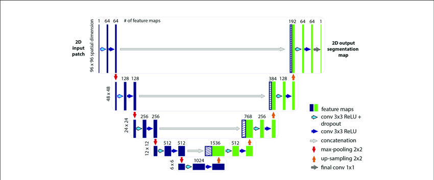
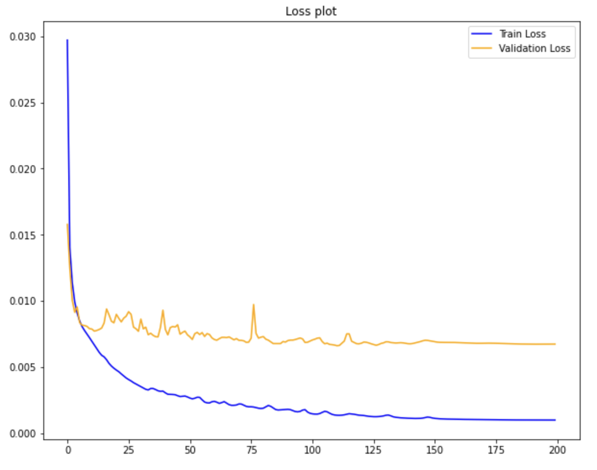
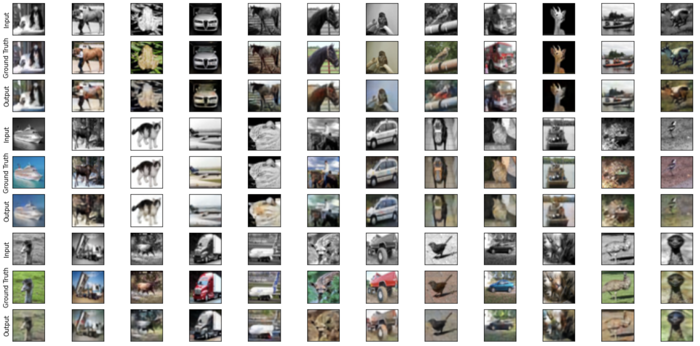

# Image-Colorization

In this repository, I implemented U-net architecture and I used it to colorize the grayscale images from CIFAR-10 dataset.

## prerequesties

- Python 3.6+
- PyTorch

## U-net Architecture

<h3 align="center">
  
</h3>

## training result

<h3 align="center">
  
</h3>

## test time results
here you can compare the model outputs and ground truth images from CIFAR-10 dataset.

<h3 align="center">
  
</h3>
